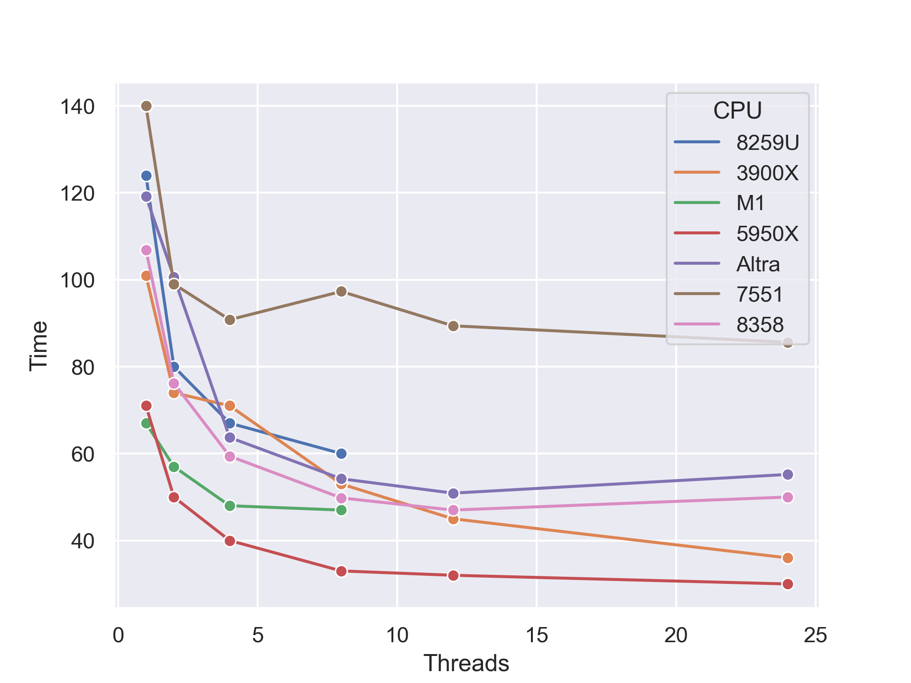
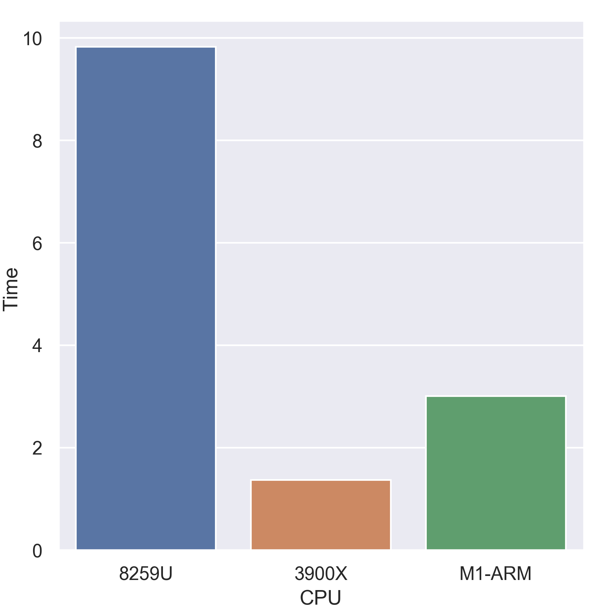
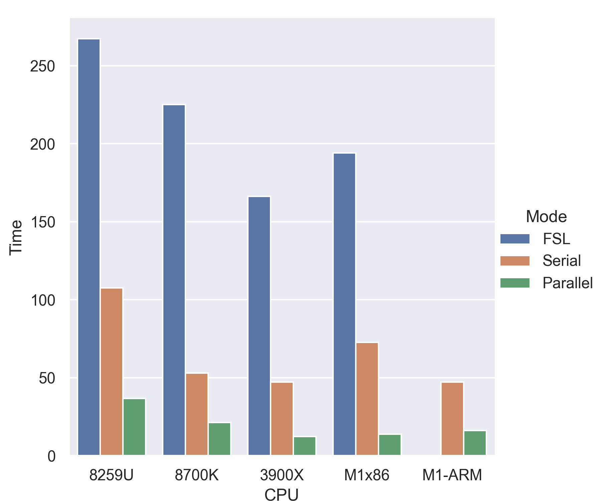
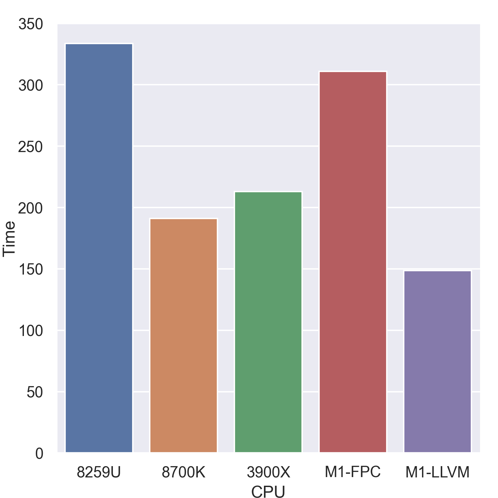
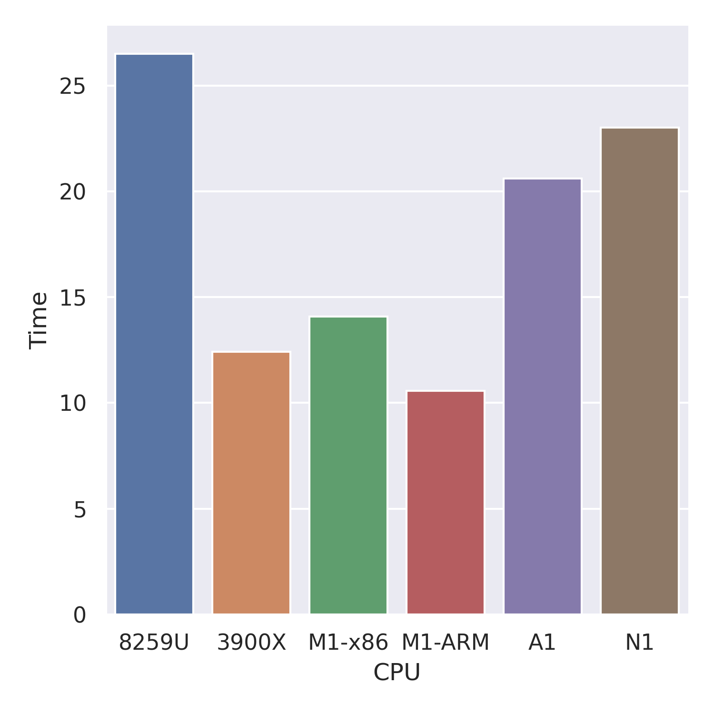
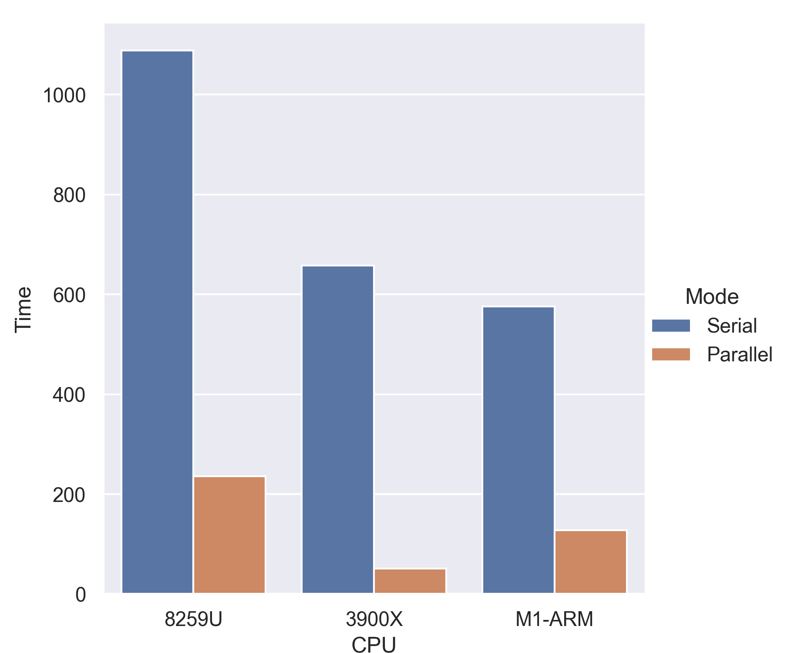
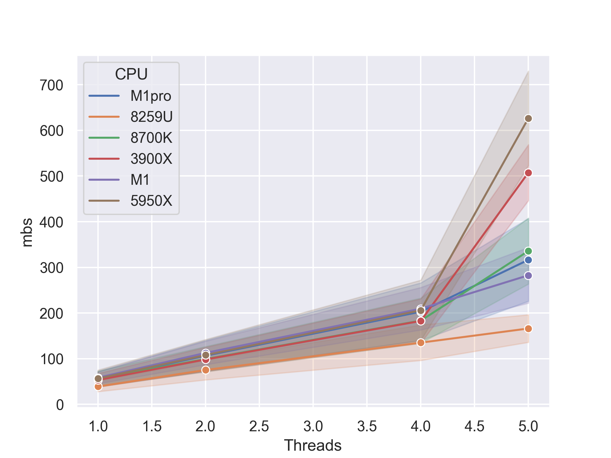
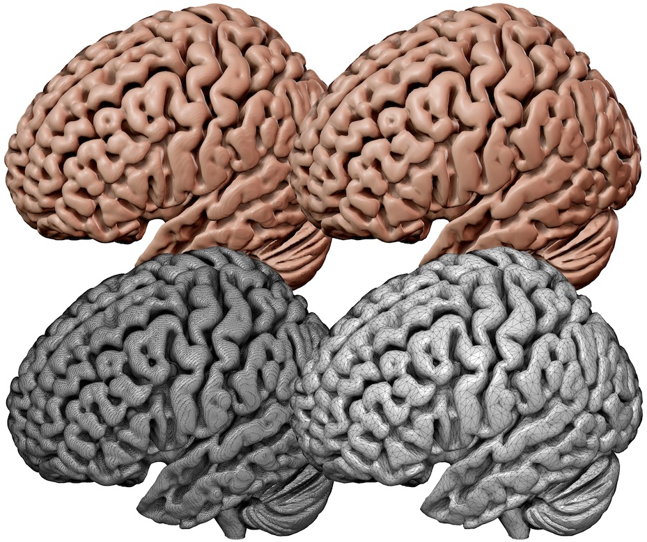
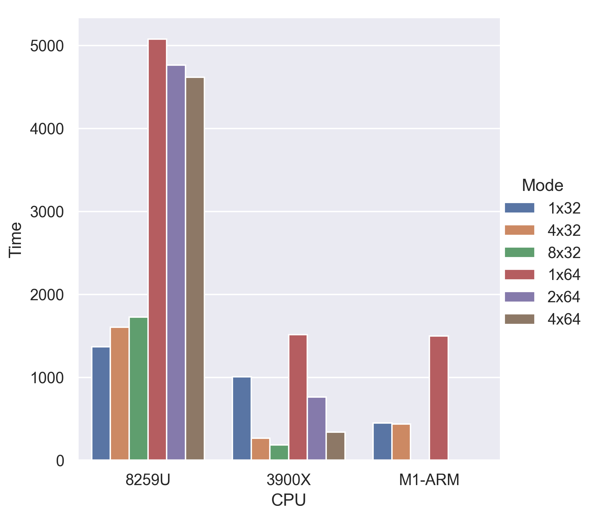

## About

Historically, Macintosh computers running macOS have been popular with brain imaging scientists. Since macOS runs Unix, users can often use the same tools on their laptop as the Linux workstations and super computers used for large datasets. However, this trend may change. First, the new [Windows Subsystem for Linux (WSL)](https://www.nemotos.net/?p=1481) has allowed Windows computers to seamlessly run Unix tools. Second, recent Macintosh computers have switched from Intel x86-64 processors to the ARM-based M1 `Apple Silicon`. This new architecture must translate existing code, and optimal performance will require tools to be recompiled. These two factors may make scientists reconsider future purchases. This page examines the potential for Apple Silicon to be used in brain imaging. 

## TL;DR

Unless you are a developer, I would strongly discourage scientists from purchasing an Apple Silicon computer in the short term. Productive work will require core tools to be ported. In the longer term, this architecture could have a profound impact on science. In particular if Apple develops servers that exploit the remarkable power efficiency of their CPUs (competing with AWS Graviton) and leverage the Metal language and GPUs for compute tasks (competing with NVidia's Tesla products and CUDA language).

## Limitations facing Apple Silicon

The infrastructure scientists depend on is not yet available for this architecture. Here are some of the short term limitations:

 - Scientists using the popular [R](https://developer.r-project.org/Blog/public/2020/11/02/will-r-work-on-apple-silicon/index.html), [Julia](https://github.com/JuliaLang/julia/issues/36617) and Python languages require an open source [Fortran compiler](https://walkingrandomly.com/?p=6696). While Python is available on Apple Silicon, tools like Numpy and [Scipy](https://github.com/scipy/scipy/wiki/Dropping-support-for-Accelerate) require Fortran compilation. One solution is to install a Python distribution like [miniconda](https://docs.conda.io/en/latest/miniconda.html) and run its pip installer to add Intel packages (the scripts included in this repository require numpy, pandas, and seaborn). There is a delay when one first imports one of these libraries while they are translated. Subsequently, the translated Python libraries appear to run well.
 - While Apple's C Clang compiler generates fast native code, many scientific tools will need to [wait](https://www.theregister.com/2020/11/18/apple_silicon_m1_mac_compatibility/) until gcc, golang and gFortran compilers are available.
 - Tools like VirtualBox, VMware Fusion, Boot Camp and Parallels do not yet support Apple Silicon. Many users rely on these tools for using Windows and Linux programs on their macOS computers.
 - Docker does not [support Apple Silicon](https://www.docker.com/blog/apple-silicon-m1-chips-and-docker/). These containers are popular with many neuroimaging tools. Docker provides an [experimental release](https://docs.docker.com/docker-for-mac/apple-m1/), but it is restricted to natively running ARM64 images, while most popular neuroimaging docker tools are built for x86-64 targets.
 - Many [homebrew components](https://github.com/Homebrew/brew/issues/7857) do not support Apple Silicon. Users will have to [install translated components](https://soffes.blog/homebrew-on-apple-silicon) or [build supported modules from source](https://github.com/mikelxc/Workarounds-for-ARM-mac).
 - MATLAB is used by many scientific tools, including SPM. While [Matlab](https://www.mathworks.com/matlabcentral/answers/641925-is-matlab-supported-on-apple-silicon-macs) works in translation, it is not yet available natively (and mex files will need to be recompiled).
 - [FSL](https://www.jiscmail.ac.uk/cgi-bin/wa-jisc.exe?A2=ind2011&L=FSL&O=D&X=E5496FE3694704BA21&Y=rorden%40sc.edu&P=163954) and AFNI do not yet natively support this architecture. While code may work in translation, creating some native tools must wait for compilers and libraries to be updated. This will likely require months.
 - The current generation M1 only has four high performance cores. Most neuroimaging pipelines combine sequential tasks that only require a single core (where the M1 excels) as well as parallel tasks. Those parallel tasks could exploit a CPU with more cores (as shown in the pigz and niimath tests below). Bear in mind that this mixture of serial and parallel code faces [Amdahls law](https://en.wikipedia.org/wiki/Amdahl%27s_law), with [diminishing returns](https://neurostars.org/t/fmriprep-multi-threading-benchmark-results/17622/2) for extra cores.
 - The current generation M1 has a maximum of 16 Gb of RAM. Neuroimaging datasets often have [large memory demands](https://neurostars.org/t/fmriprep-multi-threading-benchmark-results/17622) (especially multi-band accelerated functional, resting-state and diffusion datasets). 
 
There are some inherent weaknesses to using Macintosh for brain imaging:

 - NVidia graphics cards and therefore the CUDA language are not supported. Tools like [eddy](https://fsl.fmrib.ox.ac.uk/fsl/fslwiki/eddy), [Probtrackx](https://users.fmrib.ox.ac.uk/~moisesf/Probtrackx_GPU/index.html) and [Bedpostx](https://users.fmrib.ox.ac.uk/~moisesf/Bedpostx_GPU/Installation.html) are dramatically accelerated by this technology. Further, CUDA supports both single and double-precision computations, whereas Apple's competing Metal currently only supports single-precision computations. Single precision is sufficient for many tasks (e.g. probabilistic solutions like eddy, Probtrackx, Bedpostx), but is a limitation for some statistics.
 - While Linux is open-source, Apple's software is not. While some of Apple's attempts to protect users computers may be well intentioned, they have had [unintended consequences](https://arstechnica.com/gadgets/2020/11/macos-big-sur-launch-appears-to-cause-temporary-slowdown-in-even-non-big-sur-macs/). A primary tenet of science is replication, and therefore transparent open source code has strong appeal. Scientists often share applications they develop with each other, and recent security features introduced by Apple can challenge this. Scientists, hobbyists and others who are not full time macOS developers will  find it difficult and expensive to support  the [complex](https://sigpipe.macromates.com/2020/macos-catalina-slow-by-design/) security features of macOS. Features like [Gatekeeper Path Randomization](https://weblog.rogueamoeba.com/2016/06/29/sierra-and-gatekeeper-path-randomization/), the requirement for all native Apple Silicon executables to be code signed (locally with `codesign -s - exename`), quarantine of untrusted libraries (e.g. SPM and FSL both require calls like `xattr -dr com.apple.quarantine *.dylib`) and [application notarization](https://github.com/neurolabusc/NotarizeC) (which requires a $99 per year developer subscription) are all impediments for scientific applications.
 - Recent changes to macOS mean it should be avoided for [visual stimulation, DAQ digital/analog i/o, and running real time data collection](http://psychtoolbox.org/requirements.html). Therefore, scientists may find macOS computers are only suitable for specific niches, and are not good for all purposes.
 - Apple has [deprecated OpenGL](https://www.anandtech.com/show/12894/apple-deprecates-opengl-across-all-oses) encouraging developers to move to their modern Metal framework. Many scientific tools use OpenGL, and it is unrealistic to expect these developers to port their proven, robust tools. A few of the popular scientific tools that rely on OpenGL includes FreeSurfer, Connectome Workbench, AFNI, FSLeyes, Matlab, and Slicer 3D. It should be noted that OpenGL support for Apple Silicon is very good. It is unclear whether `deprecated` means `will not be updated` or `will be removed in an upcoming version of macOS`. If OpenGL support is removed, the operating system is no longer viable for neuroimaging research. Without clarification, developers of scientific software must seriously consider the investment they should make in supporting this operating system. 
 
 
## Potential for Apple Silicon

Initial reviews have suggested [Apple's M1 CPU has outstanding performance](https://www.anandtech.com/show/16252/mac-mini-apple-m1-tested). It includes [Rosetta2](https://www.anandtech.com/show/16252/mac-mini-apple-m1-tested/6), that will translate most x86-64 programs to Apple Silicon (AArch64) instructions providing seamless operation and reasonable performance. Indeed, as illustrated below the compatibility and performance of Rosetta2 is very impressive. There are specific features that are appealing for neuroimaging.

 - Of particular note for brain scientists is the incredible memory bandwidth and the ability of [single cores](https://www.anandtech.com/show/16252/mac-mini-apple-m1-tested) to efficiently leverage this resource. Our field has large datasets that tend to be memory rather than computation bound (the [memory wall](https://www.blosc.org/docs/StarvingCPUs-CISE-2010.pdf)).
 - While some operations lend themselves to the CPU, others are ideal for the GPU. An analogy would be transport via jet plane (CPU: moving a small amount fast), or super tanker (GPU: moving a huge amount with longer latency). However, many operations require sharing data between the [CPU and GPU](https://www.blosc.org/docs/StarvingCPUs-CISE-2010.pdf) so  [memory transfer](https://www.jiscmail.ac.uk/cgi-bin/wa-jisc.exe?A2=ind2004&L=FSL&P=R99017&X=F11DC25F019ED07848&Y=rorden%40sc.edu) can be the bottleneck. In contrast, the Apple M1 chip has unified memory, allowing the GPU and CPU to share memory without penalty.

## Testing

Four computers were tested:

 - MacBook Pro (2018) with Intel [i5-8259u](https://ark.intel.com/content/www/us/en/ark/products/135935/intel-core-i5-8259u-processor-6m-cache-up-to-3-80-ghz.html) (28w) four-core, eight-thread, maximum bandwidth 37.5 GB/s, integrated GPU.
 - Ubuntu 18.04 Intel [i7-8700k](https://ark.intel.com/content/www/us/en/ark/products/126684/intel-core-i7-8700k-processor-12m-cache-up-to-4-70-ghz.html) (95w) six-core, twelve-thread, maximum bandwidth 41.6 GB/s, with NVidia GTX [1080 Ti](https://www.geforce.com/hardware/desktop-gpus/geforce-gtx-1080-ti/specifications) (250w) GPU.
 - Ubuntu 20.04 AMD [Ryzen 9 3900X](https://www.amd.com/en/products/cpu/amd-ryzen-9-3900x) (105w) twelve-core, twenty-four-thread, maximum bandwidth 47.68 GB/s,  with NVidia GTX [1080 Ti](https://www.geforce.com/hardware/desktop-gpus/geforce-gtx-1080-ti/specifications) (250w) GPU. Tests were run on a RAM disk to maximize memory performance.
 - MacBook Air (2020) with Apple Silicon [M1](https://en.wikipedia.org/wiki/Apple_M1) (~15w) with four fast cores plus four efficiency cores, maximum bandwidth 68.25GB/s, and integrated GPU (8 Gb RAM, 256 Gb SSD, 7 GPUs). Note this configuration does not have active cooling, so performance is thermally constrained (for example, the [Mac mini M1](https://appleinsider.com/articles/20/11/24/apple-silicon-m1-mac-mini-review---speed-today-and-a-promise-of-more-later) is faster for sustained workloads).

## AFNI

[AFNI](https://afni.nimh.nih.gov) is a popular software suite for brain imaging. It is a collection of executables written in C. With a few [modifications](https://github.com/afni/afni/pull/233) it can be compiled to run natively on the Apple Silicon CPUs.

AFNI provides a [`Bigger Speed Test`](https://sscc.nimh.nih.gov/afni/doc/misc/afni_speed/index_html) which a [1.67 GHz G4 PowerBook (released in 2005)](https://everymac.com/systems/apple/powerbook_g4/specs/powerbook_g4_1.67_15.html) laptop was able to complete in 3081 seconds (this is a nice reference, as it was the fastest non-Intel based laptop sold by Apple prior to the M1-based Macs). In contrast, the M1 completes this in 47 seconds. In the graph below, the computation time is presented on the vertical axis (with less time indicating faster performance) and the number of threads shown on the horizontal axis. In this test, the M1 shows very similar performance for using just the four performance cores versus also using the efficiency cores. All systems show diminishing returns for additional cores, presumably reflecting both Amdahl's law and that the memory bandwidth is being saturated. Despite this effect, the sheer number of cores in the 3900X yields the best performance. 

The graph below shows the total time to compute the [AFNI_data6 s01.ap.simple script](https://afni.nimh.nih.gov/pub/dist/doc/htmldoc/background_install/unix_tutorial/misc/install.data.html). This is a complete pipeline, analyzing fMRI activity observed in 452 volumes of data. Some programs like 3dClustSim use OpenMP acceleration (where the 12 cores of the Ryzen help), while many stages are single-threaded. This is a nice demonstration of the real world performance of this architecture for a typical dataset.

## dcm2niix

[dcm2niix](https://github.com/rordenlab/dcm2niix) is used to convert the complicated DICOM format used in medical imaging to the simple NIfTI format popular in scientific neuroimaging. While the DICOM format allows several forms of image compression, images are typically stored uncompressed. Image conversion typically only requires a small amount of time relative to the subsequent processing and statistics. However, since dcm2niix can be easily compiled for the M1, it is an easy tool to benchmark. Here we convert [1296 DICOM uncompressed images (1.6 Gb)](https://osf.io/3m7ph/) to uncompressed NIfTI (dcm2niix can use pigz for compression, which we evaluate separately). The graph below shows conversion times, with lower values indicating faster performance. 

## Fortran

As previously noted, many scientific tools require a Fortran compiler. An experimental build of the open source gFortran compiler has just been released. The preliminary performance for this [nascent gFortran tool is described on a separate page](./fortran/README.md).  

## FSL

fslmaths handles much of the internal processing for FSL, and is a popular stand-alone tool for computation. While [FSL](https://www.jiscmail.ac.uk/cgi-bin/wa-jisc.exe?A2=ind2011&L=FSL&O=D&X=E5496FE3694704BA21&Y=rorden%40sc.edu&P=163954) is not yet compiled for Apple Silicon, translations run seamlessly. On the other hand, the [niimath](https://github.com/rordenlab/niimath) clone can be compiled for Apple Silicon.  

The graph shows the geometric mean for four computations (de-meaning, temporal filtering, Gaussian smoothing, image dilation) with lower values indicating faster performance. `FSL` denotes the performance of fslmaths. `Serial` is the performance of niimath using a single thread. `Parallel` is niimath using OpenMP. The native serial M1 code is faster than the translated code, but this is not the case for the parallel code. This might reflect that both are using the native pigz for compression, and note that gcc was used to compile the translated code while clang was used for the native code (perhaps OpenMP is not as finely tuned with clang).
 

## MRIcroGL

[MRIcroGL](https://www.nitrc.org/plugins/mwiki/index.php/mricrogl:MainPage) is a used for visualization of neuroimaging data supporting [volume rendering](https://en.wikipedia.org/wiki/Volume_rendering). It is available for Linux, Windows and macOS. For macOS, a universal binary is provided that runs natively on both x86-64 and Apple Silicon. For Windows and Linux, OpenGL is used for visualization and some compute. For macOS versions are available for both OpenGL and Metal. The latter was used here (while deprecated on macOS, OpenGL performs well, albeit a bit slower). Testing involved a [digimorph desert iguana](http://digimorph.org/specimens/Dipsosaurus_dorsalis/) that used two 512mb textures of GPU memory. 

The first test examines the CPU performance, looking at the loading, scaling and transformation of the image data. Two times are reported for native code on the M1: code generated by the [beta release of FPC](https://www.freepascal.org) with optimization disabled (due to known optimization bugs), the second using Apple's mature [LLVM/Clang](https://wiki.freepascal.org/LLVM) with optimization enabled.

The second test examines the GPU compute performance, looking at generation of the intensity [gradients](https://www.mccauslandcenter.sc.edu/mricrogl/gradients). While many have been critical of Intel integrated graphics, the i5-8259u includes the [Iris Plus Graphics 655](https://en.wikipedia.org/wiki/Intel_Graphics_Technology) with 128 MB eDRAM and 48 execution units (whereas most contemporary Intel GPUs had no eDRAM and half the number of execution units). The 8700K and 3900X both use the powerful 250w NVidia GTX 1080 Ti. In this light, the combination of the Metal compute language and the M1 GPU provides compelling performance.

## NiBabel

[NiBabel](https://nipy.org/nibabel/) is a collection of neuroimaging related Python scripts and utilities. It provides [benchmarks](https://nipy.org/nibabel/reference/nibabel.benchmarks.html) for performance and regression testing. While both Python 2.7 and 3 are provided with M1 computers, core Python libraries like numpy and scipy are not yet available as natively compiled code. For these tests, [miniconda](https://docs.conda.io/en/latest/miniconda.html) was installed, and the miniconda `pip` program was used to install x86-64 libraries (numpy, nibabel, pandas, seaborn). Rosetta2 seamlessly translated the x86-64 code the first time the libraries were launched. While native performance will surely be better, here we test the available translations.

An experimental [Python version 3.9.1rc1 that natively supports the M1](https://github.com/conda-forge/miniforge#download) including native numpy (`conda install numpy`) has been released. Note that many Python libraries do not yet support this hardware, so in practice you will have to disable this version for many tasks (`conda deactivate`). This native library performed faster than the translated library in all but one test (the finite_range test is [reliably slower](https://github.com/numpy/numpy/issues/17989)). While most native numpy tests complete, there [are still issues](https://github.com/numpy/numpy/issues/17964) as well as opportunity for architecture-specific optimizations.

The graph shows the geometric mean for the benchmarks with lower values indicating faster performance. 
 

## OpenMP

Many computational tasks can be run in parallel, leveraging the fact that modern CPUs and GPUs have many independent cores. [OpenMP](https://openmp.llvm.org) is a popular library for enabling parallel computation (e.g. afni, freesurfer, FSL and niimath). Here we test a [simple benchmark](OPENMP.md) that simulates computing a 1D Gaussian blur for a large 4D resting-state dataset. While Apple does not provide OpenMP with its compilers, it is simple to add this library ([as described here](OPENMP.md)). For the Intel and AMD CPUs, both the gcc and Clang/LLVM compilers were tested. They performed similarly, so Clang times are provided for all computers.

The graph shows the geometric mean for the benchmarks with lower values indicating faster performance. Serial shows the performance for a single core, while parallel uses all available threads (24 for the 3900X and 8 for the 8259U and M1). One can also explicitly specify the number of threads. This reveals that SMT (for the 8259U and 3900X) and the efficiency cores (for the M1) provide little benefit (not shown). The main message here is that the M1 performance cores show good parallel scaling.
 

## pigz

The GZip compression format is a staple of neuroimaging, with NIfTI images often stored in GZip format. The compression is slow (relative to decompression), but the pigz tool can use multiple threads to accelerate compression. Indeed, popular tools like AFNI and dcm2niix can use pigz. A previous review of the Apple M1 CPU examined [pigz](https://arstechnica.com/gadgets/2020/11/hands-on-with-the-apple-m1-a-seriously-fast-x86-competitor/), however that review only examined the conventional version. Here we compare both conventional pigz with an accelerated version using the [CloudFlare zlib](https://github.com/cloudflare/zlib) which leverages dedicated hardware in both Intel and ARM computers. Here we tested compression of the [Silesia compression corpus](http://sun.aei.polsl.pl/~sdeor/index.php?page=silesia) using a simple [script](https://github.com/neurolabusc/pigz-bench-python).

The graph shows compression performance as megabytes per second, with higher values indicating faster performance. The horizontal axes shows the number of threads, with actual values for 1..4 and 5 representing the use of all available threads (e.g. 8 threads for the M1 but 24 for the 3900X). The shaded color for each line illustrates the performance difference between the standard pigz (bottom of shaded region) and the CloudFlare pigz (top of shaded region).

## R

Users have been able to natively compile R and [report good performance on benchmarks as well as noting that the translated R has some problems with the interpreter](https://forums.macrumors.com/threads/data-science-r-and-spss-26-etc-under-rosetta-2-apple-silicon-m1.2269302/?post=29326680#post-29326680). Presumably, this user compiled R with the [experimental gFortran](https://github.com/fxcoudert/gfortran-for-macOS/releases). This suggests R may soon provide robust support for this architecture. In the short term, R users should be aware of [R's expectations for NaN values](https://developer.r-project.org/Blog/public/2020/11/02/will-r-work-on-apple-silicon/). Until this situation is resolved, users should be wary of using R on this architecture.

## SPM

[SPM12](https://www.fil.ion.ucl.ac.uk/spm/software/spm12/) is one of the dominant tools used for brain imaging. It uses Matlab along with compiled C code (mex files), both of which must currently be translated. In addition, the macOS is wary of the downloaded mex files, which look like malware. Therefore, users must [explicitly provide permission for these to be executed](https://transang.me/macos-open-file-from-unidentified-developers/) with a command like `xattr -dr com.apple.quarantine *.mexmaci64`. To evaluate the performance of SPM, I installed the [Clinical Toolbox](https://github.com/neurolabusc/Clinical) and timed the processing of the included tutorial dataset (`tic; clinical_mrnorm('T1.nii','lesionT2.nii','T2.nii'); toc`). Lower values indicate faster performance.

## Surfice

[Surfice](https://www.nitrc.org/plugins/mwiki/index.php/surfice:MainPage) is a used for visualization of neuroimaging data supporting [mesh rendering](https://en.wikipedia.org/wiki/Polygon_mesh). It is available for Linux, Windows and as a universal binary for MacOS (supporting both Intel and M1 CPUs). Unlike volume rendering, mesh rendering requires that the raw voxel data from MRI and CT scans is converted to a [mesh of triangles](http://paulbourke.net/geometry/polygonise/). Subsequently, we want to [adaptively simplify the mesh](http://www.alecjacobson.com/weblog/?p=4444), reducing the number of triangular faces while preserving curvature. For this task, Surfice provides a command for [fast quadric mesh simplification](https://github.com/sp4cerat/Fast-Quadric-Mesh-Simplification). To examine performance of different CPUs, we will apply a 95% reduction to a brain mesh. The figure below shows the original mesh (left column, 1486759 triangles) and the simplified mesh (right column, 74326 triangles). The upper row shows the rendered meshes - note how similar the meshes look. The lower row shows the triangles, illustrating the dramatic reduction in triangles. 

In this implementation, mesh simplification is a single-threaded test of CPU performance. The M1 dominates this test.

## NaNs

Tools like SPM use the value [`Not a Number`](https://en.wikipedia.org/wiki/NaN) to signify data that should be ignored (e.g. voxels outside the brain). Any computation (addition, subtraction, division, multiplication, etc) that includes a NaN will result in a NaN. Old timers will remember the launch of the [Pentium 4](https://imaging.mrc-cbu.cam.ac.uk/imaging/SpmWithPentium4#c_nan_test) which had remarkable performance on paper, but exhibited poor performance with SPM. This was because the Pentium 4 floating point unit (FPU) had a huge penalty for any computation with a NaN. Users had to recompile their software to use the vectorized SSE instructions which did not exhibit this penalty. Testing of the [C and Matlab](https://imaging.mrc-cbu.cam.ac.uk/imaging/SpmWithPentium4#c_nan_test) code suggests that the M1 does not exhibit a NaN penalty, and indeed can be faster for NaNs (since no real computation needs to be done).

## Double-precision floating-point format and SIMD

While 32-bit (FP32) computations are sufficient for most needs, some scientific tools demand double-precision floating-point format ([FP64](https://en.wikipedia.org/wiki/Double-precision_floating-point_format)). Indeed, tools like Matlab use FP64 by default and are tuned for this datatype. FP64 has demands for speed, efficiency and bandwidth. It is common for consumer devices like video gaming graphics cards to devote fewer resources to [FP64](https://www.microway.com/knowledge-center-articles/comparison-of-nvidia-geforce-gpus-and-nvidia-tesla-gpus/) than graphics cards used for industrial compute applications. Given the M1's heritage as a processor for consumer mobile phones, one might wonder if the FP64 performance has been compromised.

Floating-point performance was tested with a [simple C program](https://github.com/neurolabusc/simd) that compares classic scalar C code with code that explicitly uses vectorized SIMD (single instruction, multiple data). Note a smart compiler might be able to vectorize C code. In the graph below, the square-root is calculated independently for 808704000 voxels [emulating a resting state dataset](https://protocols.humanconnectome.org/HCP/3T/imaging-protocols.html). Conducting a single computation on a huge array is cache inefficient, but typical behavior for many neuroimaging tools. Therefore, on many platforms this test may be constrained by memory bandwidth rather than computational power.

The x86-64 architecture provides 128-bit SSE instructions (which can handle x4 32-bit computations or x2 64-bit computations at once), 256-bit AVX (x8, x4), and (untested) 512-bit AVX-512 (x16, x8). Note that using these power-hungry instructions can lead to a [reduction](https://blog.cloudflare.com/on-the-dangers-of-intels-frequency-scaling/) in clock [frequency](https://lemire.me/blog/2018/09/04/per-core-frequency-scaling-and-avx-512-an-experiment/). The Apple M1 includes 128-bit Neon instructions, but not the upcoming Scalable Vector Extension (SVE) instructions.

The graph shows milliseconds to compute square-root for 808704000 voxels, with lower values indicating faster performance. The blue, orange and green bars are performance for FP32 computations (scalar, 128-bit and 256-bit SIMD respectively), and the red, purple and brown show FP64. The i5-8259u appears constrained by the bandwidth of its lower power memory, as explicit vector instructions do not improve performance (the increasing time for the first three bars may reflect thermal throttling, as these were run sequentially). Obviously, all systems show a penalty for 64-bit versus 32-bit precision. The Ryzen 3900X has outstanding floating-point abilities, combined with high-performance (albeit power hungry) memory. The M1 shows no benefit from explicit use of Neon instructions, suggesting either the compiler implicitly uses them or this task is memory constrained. While the M1 is slower for double-precision (64-bit) versus single-precision (32-bit) computations, this is a stunning performance considering the 10w power envelope.

Matrix computations form the basis of many stages of neuroimaging processing and analysis. The M1 also includes [Apple Matrix Co-processors](https://nod.ai/comparing-apple-m1-with-amx2-m1-with-neon/) (AMX) which provide [512-bit double-precision and 1024-bit single-precision](https://gist.github.com/dougallj/7a75a3be1ec69ca550e7c36dc75e0d6f) SIMD instructions. While poorly documented, these instructions can be accessed via the Accelerate framework including [vecLib](https://github.com/danielchalef/openblas-benchmark-m1), vImage, libBLAS, libBNNS, vDSP and LAPACK. The double-precision performance is particularly interesting, as Metal currently only supports single-precision. Furthermore, the [Metal MPSMatrixMultiplication](https://developer.apple.com/documentation/metalperformanceshaders/mpsmatrixmultiplication](https://github.com/neurolabusc/Metal) function has a series of [limitations](https://github.com/neurolabusc/Metal) that make it unsuitable for many neuroimaging applications. Fortunately, [AMX outperforms Metal](https://github.com/neurolabusc/Metal) for single precision, provides double precision support, and does not carry the crippling limitations. Since Apple uses the same function names (e.g. cblas_dgemm) as other Basic Linear Algebra Subprograms (BLAS) libraries available for Windows and Unix, one can exploit this new hardware by simpling compiling software linked to the Apple Accelerate framework.  

Here we conduct a simple test of matrix multiplication (source code main_mmul.cpp), using a dataset designed to mimic the permutation thresholding provided by [PALM](https://github.com/andersonwinkler/PALM/blob/900e47dfd8e782afed22197243cd57df4e43963a/palm_partition.m#L1) and [NiiStat](https://github.com/neurolabusc/NiiStat/blob/79e8821480c6d0976bd7f8076f52b473a110b573/nii_stat_core.m#L677). Specifically, we calculate the matrix multiplication `C[m][n] = A[m][p] * B[p][n]` where `m = 485776, n = 16, p = 120`. This simulates the main computation for a permutation thresholded general linear model analysis (specifically, a voxel-based morphometry analysis where 485776 voxels are in the brain, there are 120 participants and a model with one effect of interest and 15 nuisance regressors). Note that this computation will be conducted thousands of times.

The graph below shows time to complete this computation, with lower values illustrating better performance. The `32` and `64` labels show 32-bit single-precision and 64-bit double precision compuation. The `scalar` values is the [popular and intuitive C solution](https://github.com/afni/afni/blob/dab76581b2ddef36dd4d5974f122e9759732c5c5/src/matrix.c#L696) without [any](https://www.cs.cornell.edu/~bindel/class/cs5220-s10/slides/lec03.pdf) common [optimizations](http://apfel.mathematik.uni-ulm.de/~lehn/sghpc/gemm/). The `blas` value shows performance for the optimized `cblas_dgemm()` function (using [libblas](https://packages.ubuntu.com/bionic/libblas-dev) for the 3900X and [Apple's Accelerate framework](https://developer.apple.com/documentation/accelerate/1513282-cblas_dgemm?language=objc) for the M1). Ryzen performance is also provided for the free but not open-source Intel [Math Kernel Library](https://en.wikipedia.org/wiki/Math_Kernel_Library) (`MKL`) and for the [NVidia CUDA](https://solarianprogrammer.com/2012/05/31/matrix-multiplication-cuda-cublas-curand-thrust/) (`cuda`) library to use the GTX 1080 Ti graphics card (see the cuda_mmul.cu source code). The timings for CUDA include the substantial memory transfer times between the CPU and GPU memory. For completeness, the included source code also evaluates the [Accelerate framework's](https://developer.apple.com/documentation/accelerate/vdsp) `vDSP_mmulD()` function, but this is omitted from the graph as it is just as fast as `cblas_dgemm()`. Finally, the source code reports the maximum difference observed between the `scalar` and `blas` results, in this case a negligible 2e-14 (one does not expect identical results, as optimized methods can use fused multiply-add operations that [reduce rounding errors](https://stackoverflow.com/questions/15933100/how-to-use-fused-multiply-add-fma-instructions-with-sse-avx)).

 

## Conclusions

It is remarkable that the M1 CPU in the MacBook Air has no fan, yet holds its own in these neuroimaging benchmarks. The promise of this architecture is hard to deny.

## Software Evaluated

Here is the status of a few tools I have evaluated. This selection is necessarily biased by my own tasks.

 - Native support
   - [dcm2niix](https://github.com/rordenlab/dcm2niix)
   - [MRIcroGL](https://github.com/rordenlab/MRIcroGL12/releases)
   - [MRIcron](https://github.com/neurolabusc/MRIcron/releases)
   - [Surfice](https://github.com/neurolabusc/surf-ice/releases)
 - Translated Applications Appear to Function
   - [AFNI](https://afni.nimh.nih.gov) (experimental native compile for [all tools except SUMA](https://github.com/neurolabusc/afni)) 
   - [FSL](https://fsl.fmrib.ox.ac.uk/fsl/fslwiki/)
   - [Slicer](https://www.slicer.org)
   - [SPM12](https://www.fil.ion.ucl.ac.uk/spm/software/spm12/)
 - Unsupported
   - [Paraview](https://www.paraview.org) (solution: use version [prior to 5.6.1](https://discourse.paraview.org/t/paraview-on-new-macs-with-m1-chips/5909/9))
 

## Links

 - [AnandTech](https://www.anandtech.com/show/16252/mac-mini-apple-m1-tested) provides a deep dive into the workings of the new M1 chip and its performance.
 - [Arstechnica](https://arstechnica.com/gadgets/2020/11/hands-on-with-the-apple-m1-a-seriously-fast-x86-competitor/) reviews M1 performance.
 - [Forbes](https://www.forbes.com/sites/patrickmoorhead/2020/11/21/apple-macbook-pro-13-m1-reviewwhy-you-might-want-to-pass/?sh=1542cd81786a) provides a more tempered review, noting issues that early adopters may face.
 - [Phoronix](https://www.phoronix.com/scan.php?page=article&item=apple-mac-m1&num=1) explores native and translated M1 performance on many benchmarks.
 - [PugetSystems](https://www.pugetsystems.com/labs/articles/Apple-M1-MacBook-vs-PC-Desktop-Workstation-for-Adobe-Creative-Cloud-1975/) examines M1 laptops versus x86-64 workstations. The professional applications leverage multiple threads and modern GPUs to the hilt. 
 - [Suhun Han](https://tech.ssut.me/apple-m1-chip-benchmarks-focused-on-the-real-world-programming/) investigates M1 Java performance, including the SciMark (and also uses the AMD 3900X as a reference).
 - [Tuh Do](https://github.com/tuhdo/tuhdo.github.io/blob/c3b417ba2fc81768f656dadf87bf3dd28ba47182/emacs-tutor/zen3_vs_m1.org) evaluates the M1, Ryzen 3900X and more latest 5800X CPUs.
 
